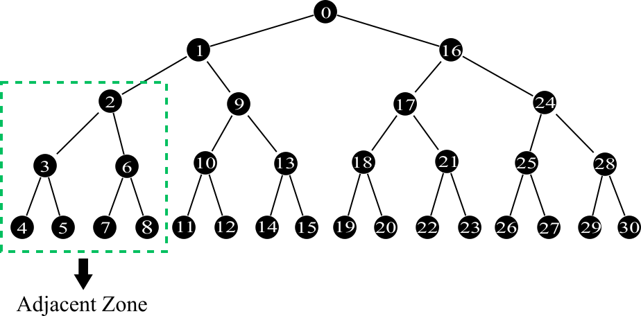

# 改进Merkle Patricia Trie的存储方式

Merkle Patricia Trie（以下简称MPT）是一种融合了默克尔树和前缀树优点的数据结构，在以太坊、唯链以及其他一些基于账户模型的区块链项目中有着广泛的应用。关于MPT的具体原理和细节可以[看这里](https://github.com/ethereum/wiki/wiki/Patricia-Tree)。

MPT在算法的意义上来说很高效，它提供时间复杂度为O(log<sub>16</sub>(n))的插入、查询、删除操作，其中n表示叶子节点的数量。MPT一般使用KV数据库作为存储空间，通常以节点数据作为值，节点数据的哈希作为键。在不考虑缓存的情况下，由于哈希的随机性，一次MPT操作会转化对KV数据库的log<sub>16</sub>(n)次随机访问。截止到本文撰写的时间，以太坊账户数已经达到85484692个，这意味着，对某个以太坊账户的一次简单的余额查询，将会转化为平均log<sub>16</sub>85484692 ≈ 6.6次KV数据库的随机查询，由此产生同等（或者更多）次数的磁盘IO。

基于以上，从工程实践的角度看，MPT的性能似乎被高估了，这在以太坊采纳[EIP-150](https://eips.ethereum.org/EIPS/eip-150)和[EIP-1884](https://eips.ethereum.org/EIPS/eip-1884)的升级中得到了印证。以太坊核心团队和社区成员基于对历史性能数据的细致分析，大幅提高了SLOAD，BALANCE等指令的价格。这一过程具有一定说服力，但存在若干瑕疵。首先，这对先前部署的合约有影响，甚至可能导致合约不工作，本文对此不作讨论。其次，提升指令价格的依据依赖于当前时点特定的客户端实现（geth），个人认为这是鲁莽的。geth中对MPT优化的重点集中在缓存的设计，而忽略了存储层面的优化。当然，为MPT设计一个专用存储引擎的代价似乎太大了，那么能否从改变数据在存储空间的分布这个角度出发呢？

接下来，将给出一种简单的存储优化方案。此方案适用于leveldb数据库（或其他LSM型数据库），基于有序读操作更加快速这个事实，通过改变节点在数据库中的分布，达成MPT访问速度提升一倍以上，节点遍历速度提升若干数量级的效果。前面提到，通常MPT节点存储的键是节点数据的哈希，而哈希是高度随机的，任何数据库都无法做到足够快速的查询随机分布的记录，leveldb也不例外。考虑到MPT本身是前缀树，因此也是有序树，它的有序性体现在节点路径。于是，思路呼之欲出：重新定义存储节点的键（记作K），把节点路径转化为前缀（记作P），节点哈希（记作H)紧随其后，即：K=P⋅H。为了让K具有稳定的字节序，P必须是定长编码的，不妨定义P的长度为8字节（由于MPT节点前缀是半字节的，因此可容纳最大长度为16的路径），因此K的长度就是8+32=40字节。用golang伪代码表示K的构造过程：

```golang
var K [40]byte
var P = K[:8]

pathLen := min(len(path), 15)
// compact at most 15 nibbles and term with path len.
for i := 0; i< pathLen; i++ {
    if i%2 == 0 {
        P[i/2] |= (path[i] << 4)
    } else {
        P[i/2] |= path[i]
    }
}
P[7] |= byte(pathLen)

copy(K[8:], H[:])
```

仔细观察代码不难看出，K符合节点遍历顺序，由此带来的直接好处是，节点遍历速度会有若干数量级的提升！如图（为了视觉直观，用二叉树代替）：



并且顶部子树的节点会形成毗连区域，即图中被框出的部分。毗连区域很大概率会处于leveldb的同一个block中，连续访问同一block中的数据远快于随机分布于多个block中的数据。每一次MPT查询，必然有部分节点处于同一毗连区域，因此查询速度将得到显著提升。改进前后性能对比测试代码可以在[这里](https://github.com/vechain/thor/tree/master/muxdb/benchmark)找到（当前只支持macOS）。另外，这项改进会带来一个有意思的副作用：leveldb的数据压缩率提高了近30%。至于为什么，就留给你去发现吧。

唯链1.3.0版本中应用了这项改进，大幅提高了状态访问指令的性能，从而使唯链网络的带宽得到提升，也使“动态差分式状态树清理”功能成为可能。

参考链接：

- [Patricia Tree ⋅ ethereum/wiki](https://github.com/ethereum/wiki/wiki/Patricia-Tree)
- [Introduction to leveldb](https://github.com/google/leveldb/blob/master/doc/index.md)
- [VeChain/Thor: A general purpose blockchain highly compatible with Ethereum's ecosystem](https://github.com/vechain/thor)

